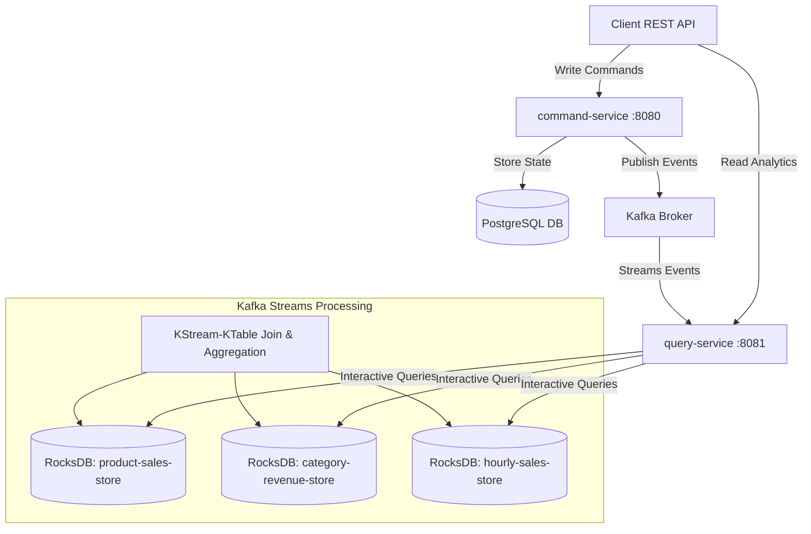

# Event-Driven CQRS E-Commerce Analytics System

A production-ready e-commerce analytics platform utilizing the Command Query Responsibility Segregation (CQRS) pattern with Apache Kafka, Kafka Streams, and PostgreSQL.

This architecture separates write-heavy transaction operations (`command-service`) from read-heavy analytical aggregations (`query-service`). Real-time state changes are published as events to Kafka, which are then processed by a Kafka Streams topology to construct materialized views exposed through an interactive query REST API.

---

## Architecture Overview



- **Command Model (`command-service`)**: Handles creation of products, orders, and status updates. It persists entity state in a PostgreSQL database and publishes `ProductCreated`, `OrderCreated`, and `OrderUpdated` events to Kafka.
- **Query Model (`query-service`)**: Consumes events from Kafka, builds a stream topology to enrich orders with category data via a KStream-KTable join, performs real-time analytics, and materializes aggregated data into local RocksDB state stores.
- **Exactly-Once Semantics (EOS)**: Configured with `exactly_once_v2` to guarantee data integrity across transaction boundaries.

---

## Technology Stack

- **Core Framework**: Java 21, Spring Boot 3.3.x, Spring Kafka, Spring Data JPA
- **Database**: PostgreSQL 14 (with native JSONB columns mapped via Hibernate 6 `@JdbcTypeCode(SqlTypes.JSON)`)
- **Event Streaming & Aggregation**: Apache Kafka, Kafka Streams
- **Storage**: RocksDB (embedded state store)
- **Deployment**: Docker Compose (multi-stage builds)
- **Testing & Coverage**: JUnit 5, MockMvc, `TopologyTestDriver`, JaCoCo

---

## Getting Started

### Prerequisites
- Docker & Docker Compose
- Java 21 & Maven 3.9 (if building/running outside Docker)

### Run the Entire Stack
1. Clone the repository and navigate to the root directory.
2. Build and start the stack:
   ```bash
   docker compose up -d --build
   ```
3. Verify that all services are running and healthy:
   ```bash
   docker compose ps
   ```
   *Expected containers:* `cqrs_db`, `zookeeper`, `kafka`, `event-driven-cqrs-command-service-1`, and `event-driven-cqrs-query-service-1`.

---

## API Reference

### Write API (`command-service` on port `8080`)

#### 1. Create a Product
- **Endpoint**: `POST /api/products`
- **Payload**:
  ```json
  {
    "name": "Sony WH-1000XM4 Headphones",
    "category": "Electronics",
    "price": 348.00
  }
  ```
- **Response**: `201 Created` with the saved product details (including auto-generated ID).

#### 2. Create an Order
- **Endpoint**: `POST /api/orders`
- **Payload**:
  ```json
  {
    "customerId": 42,
    "items": [
      {
        "productId": 1,
        "quantity": 2,
        "price": 348.00
      }
    ]
  }
  ```
- **Response**: `201 Created` with the initialized order state (`status: "CREATED"`).

#### 3. Update Order Status
- **Endpoint**: `PUT /api/orders/{id}/status`
- **Payload**:
  ```json
  {
    "status": "PAID"
  }
  ```
- **Response**: `200 OK` with updated order details.

---

### Query & Analytics API (`query-service` on port `8081`)

#### 1. Get Product Sales
Queries the `product-sales-store` materialized view for units sold and total revenue of a specific product.
- **Endpoint**: `GET /api/analytics/products/{productId}/sales`
- **Response**:
  ```json
  {
    "productId": 1,
    "totalSales": 696.00
  }
  ```

#### 2. Get Category Revenue
Queries the `category-revenue-store` materialized view for aggregated revenue in a category.
- **Endpoint**: `GET /api/analytics/categories/{category}/revenue`
- **Response**:
  ```json
  {
    "category": "Electronics",
    "revenue": 696.00
  }
  ```

#### 3. Get Hourly Global Sales
Queries the `hourly-sales-store` windowed materialized view to fetch tumbling 1-hour windows of global sales revenue.
- **Endpoint**: `GET /api/analytics/hourly-sales`
- **Response**:
  ```json
  [
    {
      "windowStart": "2026-06-12T18:00:00Z",
      "windowEnd": "2026-06-12T19:00:00Z",
      "totalSales": 696.00
    }
  ]
  ```

#### 4. Get Kafka Streams Topology
- **Endpoint**: `GET /api/analytics/topology`
- **Response**: Text description of the Kafka Streams processor DAG.

---

## Verification & Testing

Both projects contain extensive unit and integration tests. The query-service utilizes Kafka Streams' `TopologyTestDriver` to mock stream transformations and state stores.

### Running Unit Tests Locally
To run tests and generate JaCoCo coverage reports inside Docker:

- **Command Service Tests**:
  ```bash
  docker run --rm -v "%USERPROFILE%\.m2:/root/.m2" -v "%CD%/command-service:/app" -w /app maven:3.9.6-eclipse-temurin-21-alpine mvn test
  ```

- **Query Service Tests**:
  ```bash
  docker run --rm -v "%USERPROFILE%\.m2:/root/.m2" -v "%CD%/query-service:/app" -w /app maven:3.9.6-eclipse-temurin-21-alpine mvn test
  ```

### Code Coverage Metrics
- **Command Service**: **93.9%** (Instruction Coverage)
- **Query Service**: **91.5%** (Instruction Coverage)
